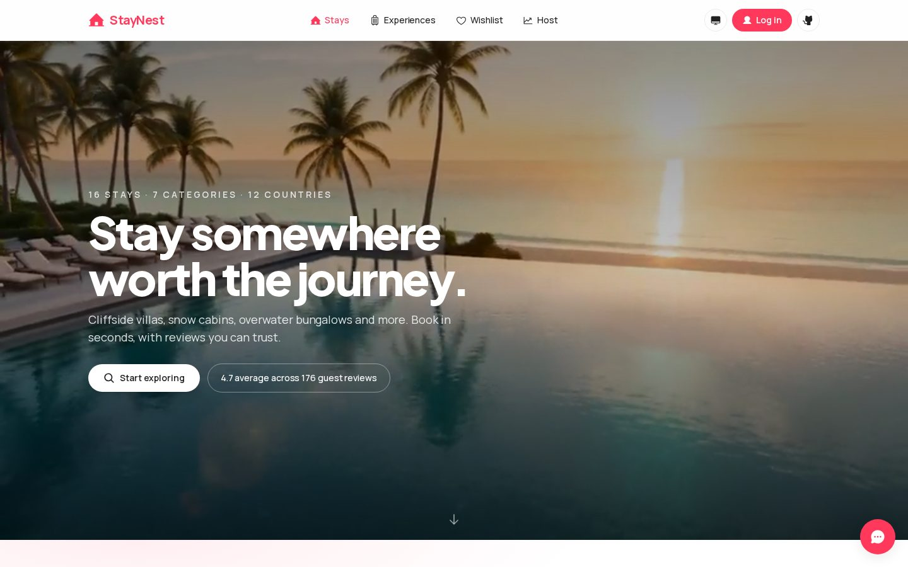
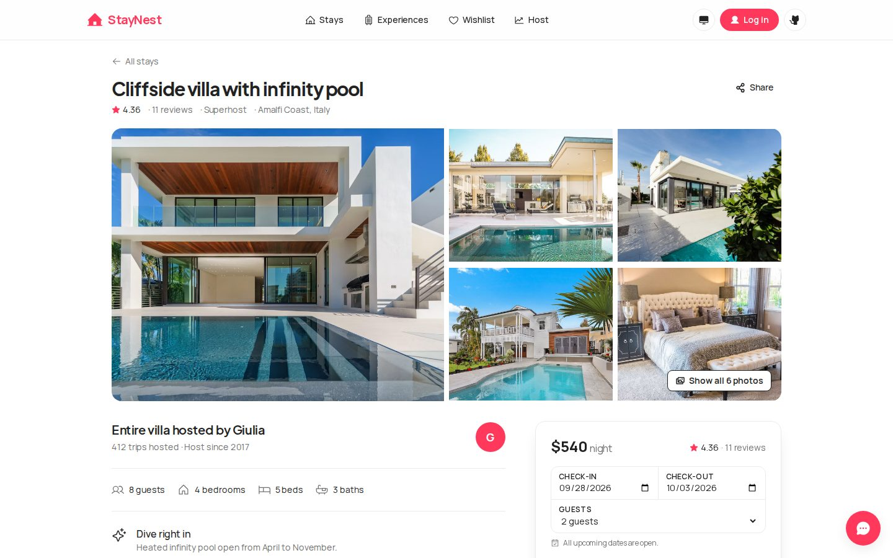
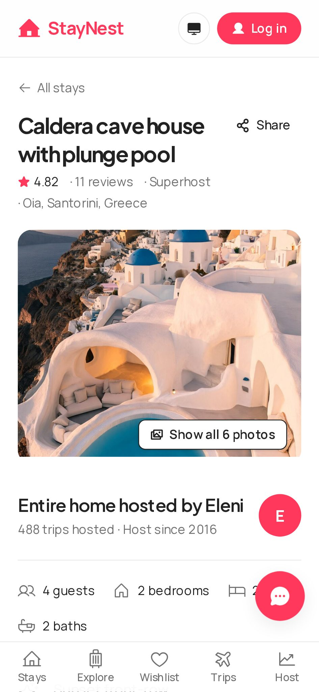
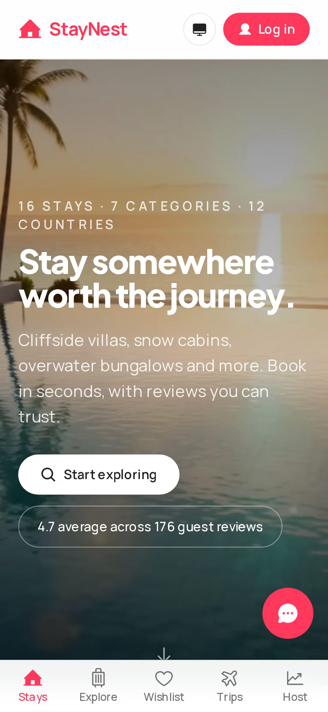

<p align="center">
  
</p>

<h1 align="center">StayNest</h1>

<p align="center">
  A production-grade stay-booking web app — 16 hand-written stays in 12 countries, 176 real guest reviews,
  live availability, wishlists, trips, a host dashboard and a keyword FAQ assistant.<br/>
  Built with <b>Next.js 16 · React 19 · TypeScript (strict) · Tailwind v4 · Supabase</b>.
</p>

<p align="center">
  <a href="https://staynest-two.vercel.app"></a>
  <a href="https://github.com/D-L-Narayana/staynest/actions/workflows/ci.yml"></a>
  
  
  
  <a href="LICENSE"></a>
</p>

<p align="center">
  <a href="https://staynest-two.vercel.app"><b>Live demo →</b></a> · no sign-up needed (guest mode) ·
  <a href="#-architecture">Architecture</a> · <a href="#-testing">Testing</a> · <a href="#-performance-measured">Performance</a> · <a href="AUDIT.md">Audit</a>
</p>

---

## ✨ What it does

| Guest experience                                                                                                                                                                         | Host experience                                                                              | Platform                                                                                   |
| ---------------------------------------------------------------------------------------------------------------------------------------------------------------------------------------- | -------------------------------------------------------------------------------------------- | ------------------------------------------------------------------------------------------ |
| Search 16 stays by destination, guests, price, sort, category and 15 amenity/bedroom filters                                                                                             | Host dashboard with **real** revenue, occupancy and booking stats computed from the database | Light / dark / system theme + 5 accent palettes, all WCAG AA                               |
| Listing pages with a photo gallery + lightbox, 176 genuine reviews, category ratings, similar stays, a map and a booking widget with live availability and a transparent price breakdown | Create, edit and delete your own listings (persisted per device)                             | Mobile tab bar, skeleton / empty / error states on every route, keyboard-navigable dialogs |
| Wishlist that syncs to Supabase per device (works without an account), Trips with `.ics` calendar export                                                                                 | Bookings and inquiries appear in the dashboard in real time                                  | Email/password auth **or one-tap guest mode**, PWA manifest, sitemap, Open Graph           |
| “Nestor”, a keyword-scored FAQ assistant with 1,252 Q&A pairs across 40 topics — no LLM, no API key                                                                                      |                                                                                              | 9 typed REST endpoints with validation                                                     |

<p align="center">
  
  
</p>
<p align="center">
  
  
  
</p>

## 🚀 Run it locally

```bash
git clone https://github.com/D-L-Narayana/staynest.git && cd staynest
npm ci
cp .env.example .env.local     # optional — the app runs fully without Supabase (in-memory fallbacks)
npm run dev                    # http://localhost:3000
```

| Script                                                        | What it does                                                                             |
| ------------------------------------------------------------- | ---------------------------------------------------------------------------------------- |
| `npm run dev` / `npm run build` / `npm start`                 | Next.js dev server, production build (27 static pages + 9 API routes), production server |
| `npm run lint` · `npm run typecheck` · `npm run format:check` | ESLint 9 (flat config, `react-hooks` v7 rules) · `tsc --noEmit` (strict) · Prettier      |
| `npm test` · `npm run test:coverage`                          | 65 Vitest + Testing Library unit tests (~17 s)                                           |
| `npm run test:e2e`                                            | 28 Playwright scenarios: 14 specs × (Desktop Chrome + Pixel 7)                           |

Environment variables (`.env.example`): `NEXT_PUBLIC_SUPABASE_URL`, `NEXT_PUBLIC_SUPABASE_ANON_KEY` (public anon key — data is protected by RLS) and optional `NEXT_PUBLIC_SITE_URL`. No secret is ever needed in the client or repo.

## 🏗 Architecture

```
src/
├─ app/
│  ├─ page.tsx                 server component: real stats + destinations, streams HomeClient
│  ├─ HomeClient.tsx           search, filters, category rail, map/list toggle (URL-synced)
│  ├─ listing/[id]/            server-rendered listing, generateMetadata, notFound(), reviews
│  ├─ wishlist/ trips/ host/ experiences/   client routes on top of the REST API
│  ├─ api/                     9 route handlers (see table)
│  ├─ components/              21 files · 41 typed React components
│  ├─ error.tsx · not-found.tsx · manifest.ts · sitemap.ts · robots.ts
│  └─ globals.css              design tokens (light/dark × 5 accents, all ≥ 4.5:1)
├─ lib/
│  ├─ pricing.ts               single source of truth for nightly × nights + cleaning + 12 % fee
│  ├─ search.ts                one filter/sort implementation shared by API and UI
│  ├─ bookings(.server).ts     overlap detection + Supabase persistence
│  ├─ stats.server.ts          live counts/averages for the hero and host dashboard
│  ├─ storage.ts               typed, SSR-safe localStorage hook (useSyncExternalStore)
│  ├─ wishlist.tsx             WishlistProvider: optimistic updates that survive stale responses
│  ├─ supabase.ts / supabaseBrowser.ts   server client · lazily-loaded browser client
│  └─ chatbot-kb.ts            1,252-entry FAQ knowledge base (lazy-loaded, 264 KB)
├─ e2e/                        Playwright specs (home, listing, wishlist+theme, api)
└─ test/                       Vitest setup (jsdom, Testing Library, fetch/localStorage mocks)
```

**Design decisions**

- **Server-first.** The home and listing pages are React Server Components that fetch stats, reviews and availability on the server; only interactive islands ship JS. Unknown listings return a real HTTP 404 (`notFound()`), not a streamed 200.
- **One implementation per rule.** Price breakdown and search filtering used to be duplicated between UI and API; they now live in `lib/pricing.ts` and `lib/search.ts` and are unit-tested to 97–98 % line coverage.
- **Optimistic UI done carefully.** `WishlistProvider` keeps an overlay of in-flight toggles so a slow initial `GET` can never overwrite a click that happened after it started.
- **Degrades gracefully.** Without Supabase the API falls back to in-memory data, so a clone runs with zero setup.
- **Lazy by default.** `@supabase/supabase-js` (240 KB) is imported only when someone opens the auth modal; Nestor's 264 KB knowledge base loads on first open; the hero video is fetched only on desktop, when idle, and never with `prefers-reduced-motion`.

### REST API

| Route               | Method              | Notes                                                                                                         |
| ------------------- | ------------------- | ------------------------------------------------------------------------------------------------------------- |
| `/api/listings`     | GET                 | Search + filters + sort (`q`, `guests`, `maxPrice`, `category`, `amenities`, `bedrooms`, `superhost`, `sort`) |
| `/api/listing/[id]` | GET                 | Single listing, 404 for unknown ids                                                                           |
| `/api/availability` | GET                 | Booked date ranges for a listing, used by the booking widget                                                  |
| `/api/book`         | POST                | Validates dates, guests and overlap; computes the price server-side                                           |
| `/api/reviews`      | GET · POST          | 176 seeded reviews; POST validates rating 1–5 and body length                                                 |
| `/api/wishlist`     | GET · POST · DELETE | Device-scoped wishlist (`X-Device-Id`), persisted in `staynest_wishlist`                                      |
| `/api/host`         | GET                 | Revenue / occupancy / bookings per listing, 6-month trend                                                     |
| `/api/inquiries`    | POST                | Contact-host messages                                                                                         |
| `/api/experiences`  | GET                 | Experiences and services catalogue                                                                            |

### Data & security

Supabase Postgres tables `staynest_reviews`, `staynest_bookings`, `staynest_wishlist`, `staynest_inquiries`, `staynest_experiences`, `staynest_services` with RLS enabled, `WITH CHECK` constraints on inserts (rating range, body length, date sanity) and indexes on the hot columns (`listing_id`, `device_id`, date ranges).

> **Honest note on the wishlist policy.** Wishlist rows are scoped by an anonymous device id rather than an authenticated user, so the `DELETE` policy cannot be narrowed to `auth.uid()`. The API route is the only writer and always filters by the caller's device id, but a determined user could delete another device's rows via the anon key. Moving wishlists to authenticated users is the top item on the roadmap.

## 🧪 Testing

| Layer            | Tooling                                     | Count                                            | What is covered                                                                                                                                                                                                                                   |
| ---------------- | ------------------------------------------- | ------------------------------------------------ | ------------------------------------------------------------------------------------------------------------------------------------------------------------------------------------------------------------------------------------------------- |
| Unit / component | Vitest 4 + Testing Library + jsdom          | **65 tests · 14 files**                          | `pricing` (97.9 %), `search` (97.7 %), `bookings`, `destinations`, `stats`, `storage`, `theme`, `trips`, `userListings`, `wishlist` race conditions; `ListingCard` (100 %), `BookingWidget` (83.7 %), `FiltersModal` (79.3 %); API route handlers |
| End-to-end       | Playwright 1.59                             | **28 scenarios** (14 × Desktop Chrome + Pixel 7) | Search → results → filters → clear; listing → reviews → booking price breakdown; wishlist toggle persists across reload; theme switch persists; 404 status; API contracts                                                                         |
| Static           | `tsc --strict`, ESLint 9, Prettier          | 0 errors                                         | Includes React 19 `react-hooks` v7 rules (`set-state-in-effect`, purity)                                                                                                                                                                          |
| CI               | GitHub Actions (`.github/workflows/ci.yml`) | 2 jobs                                           | `quality` (lint · typecheck · format · unit) and `e2e` (build · Playwright, trace on retry) on every push and PR                                                                                                                                  |

Overall statement coverage is **40 %** (`npm run test:coverage`) — high on the business logic that matters, deliberately lower on presentational markup.

## ⚡ Performance (measured)

Lighthouse 12.8.2, run against **https://staynest-two.vercel.app** on 2026-09-21 with headless Chromium (`lighthouse <url> --output=json`, mobile = default simulated Moto G Power / slow 4G; desktop = `--preset=desktop`):

|                              | Performance | Accessibility | Best Practices | SEO     | FCP   | LCP   | TBT    | CLS |
| ---------------------------- | ----------- | ------------- | -------------- | ------- | ----- | ----- | ------ | --- |
| **Mobile**                   | **94**      | **100**       | **100**        | **100** | 1.2 s | 2.7 s | 150 ms | 0   |
| **Desktop**                  | **99**      | **100**       | **100**        | **100** | 0.3 s | 0.7 s | 0 ms   | 0   |
| Before this release (mobile) | 34          | 90            | 100            | 100     | —     | —     | 20.9 s | —   |

What moved the needle:

| Change                                                                                                                            | Evidence                                                                             |
| --------------------------------------------------------------------------------------------------------------------------------- | ------------------------------------------------------------------------------------ |
| Home page became a server component; interactive islands only                                                                     | TBT 20.9 s → 150 ms on mobile                                                        |
| Hero video re-encoded (H.264 CRF 30, 960 px, 24 fps) and loaded only on desktop, after idle, never under `prefers-reduced-motion` | `public/landing/hero.mp4` 6.86 MB → `hero-960.mp4` 0.92 MB; mobile media requests: 0 |
| `@supabase/supabase-js` and the 1,252-entry FAQ KB moved out of the initial bundle                                                | −240 KB and −264 KB (uncompressed) of JS on every route                              |
| LCP image preloaded with `fetchpriority="high"`, explicit `width`/`height` on every card image                                    | CLS 0, LCP 0.7 s desktop                                                             |
| Contrast-safe brand tokens for all 5 accents in both themes                                                                       | axe `color-contrast` 0 failures; Accessibility 100                                   |

## ♿ Accessibility & responsiveness

Verified at 360 / 768 / 1024 / 1440 px with no horizontal overflow, keyboard-only navigation through the filter and auth dialogs (focus trap, `Escape`, `aria-modal`), visible focus rings, `aria-pressed` theme controls, labelled form controls, 24 px minimum tap targets, 12 px minimum text, and `prefers-reduced-motion` respected by every animation and the hero video.

## 🗺 Roadmap

- [ ] Authenticated wishlists (`auth.uid()`-scoped RLS) and cross-device sync
- [ ] Host photo uploads via Supabase Storage
- [ ] Review submission for completed trips
- [ ] i18n (currency and dates) and a proper map on the listing page (currently an OpenStreetMap embed)
- [ ] Visual regression tests with Playwright snapshots

## 📄 License

[MIT](LICENSE) © 2026 D L Narayana · Listing photos via [Unsplash](https://unsplash.com/license).
